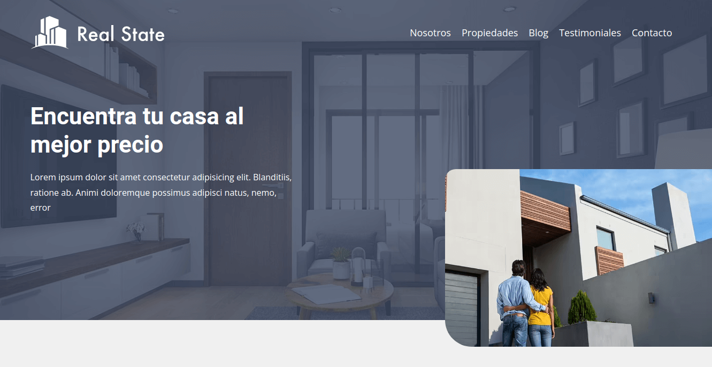
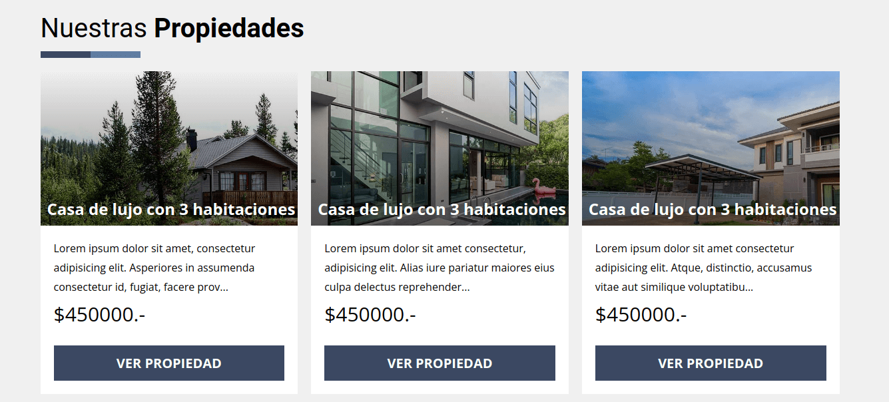
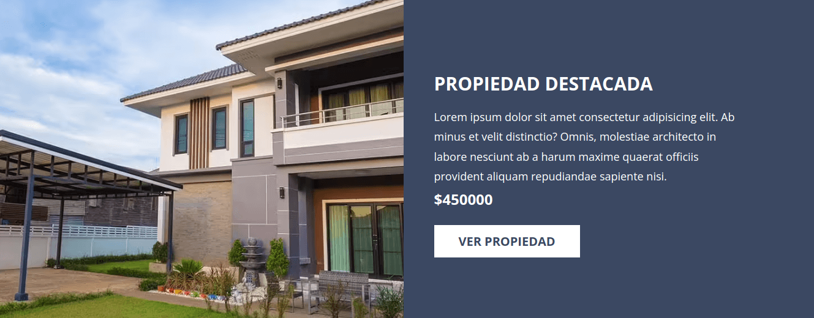
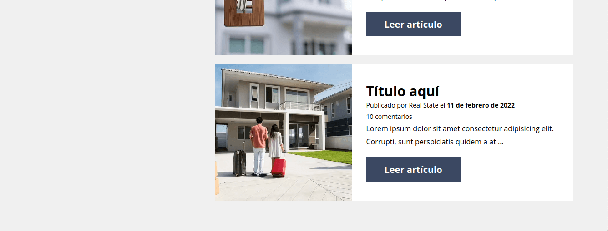

# Real State

## Screenshots









## Installation

### clone repo

* **gh CLI**

``` cmd
gh repo clone norbix14/css-real-state realstate
```

* **git**

``` cmd
git clone https://github.com/norbix14/css-real-state.git realstate
```

### folder

``` cmd
cd realstate/
```

### install dependencies

``` cmd
npm i
```

## before run the app

### **gulp** tasks

* optimize *png or jpg* images (from **./src/images_raw/** to **./src/img/**)

``` cmd
gulp optimizeImages
```

* build **webp** images (transform **all** images into *.webp*)

```cmd
gulp buildImagesWebp
```

* build **avif** images (transform **all** images into *.avif*)

```cmd
gulp buildImagesAvif
```

* manually transform *scss* into *css*

```cmd
gulp buildCss
```

* watch changes in *scss* files (same as *gulp* command below)

```cmd
gulp dev
```

* transform *scss* into *css* (default task) and watch for changes

```cmd
gulp
```

### copy files into **dist** (Linux Ubuntu)

* copy all files recursively except:
  * *images_raw* folder which is optimized by **gulp** in the *img* folder
  * *scss* folder wich is transformed by **gulp** in the *css* folder

```cmd
cp -r src/!(images_raw|scss) dist/
```

## run the app

* using the current folder

  * double click on **src/index.html** or open it with **Live Server**

* using the **dist** folder

  * double click on **dist/index.html** or open it with **Live Server**
